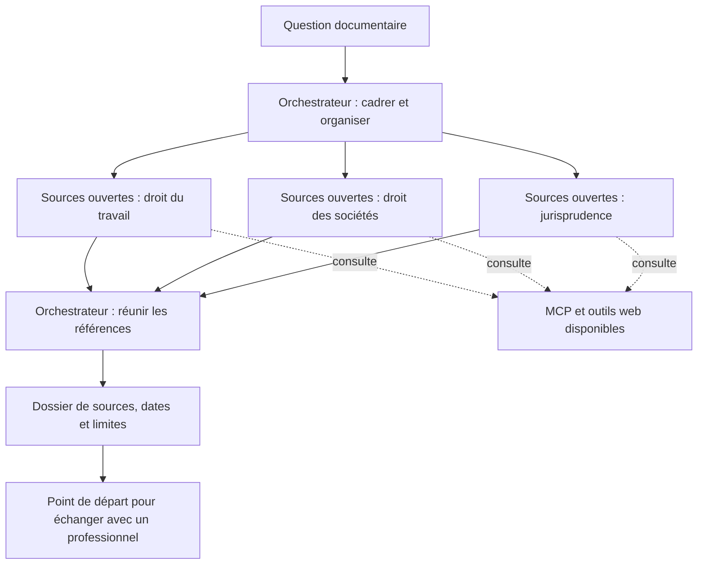

# LexOSINT

> [!WARNING]
> **Recherche documentaire uniquement. Aucun conseil juridique professionnel.**
>
> LexOSINT aide à trouver, lire et organiser des sources ouvertes liées au droit du travail et au droit des sociétés. Les résultats peuvent être incomplets, inexacts ou ne pas correspondre à votre situation. Ils ne constituent ni une consultation juridique, ni une validation de vos droits ou de vos démarches.
>
> **Cet outil ne remplace pas le travail d'un avocat ou d'un juriste.** Utilisez-le comme point de départ documentaire. En cas de doute, de délai à respecter ou avant une décision engageante, consultez un professionnel compétent dans le domaine concerné.

**Un agent orchestrateur et trois sous-agents documentaires pour Codex et Claude Code.**

Les publications juridiques sont dispersées et parfois difficiles à consulter. LexOSINT organise leur recherche dans les sources accessibles : textes, conventions collectives, décisions publiées, registres et actes publics. Il rassemble les références, leurs dates, les extraits utiles et les limites de la collecte.

## Comment cela fonctionne



L'orchestrateur sélectionne les recherches utiles. Une question simple ne lance pas trois sous-agents. Si la délégation est indisponible, il applique les grilles successivement et le signale. Les sous-agents ne portent aucun titre professionnel et ne rendent pas d'avis juridique.

## Trois domaines de collecte

| Sous-agent | Sources recherchées |
|---|---|
| **Sources ouvertes, droit du travail** | Code du travail, conventions collectives, accords accessibles, fiches et outils officiels |
| **Sources ouvertes, droit des sociétés** | Textes, identité d'entreprises, registres, annonces et actes publics accessibles |
| **Sources ouvertes, jurisprudence** | Décisions publiées, références, juridictions, dates et passages pertinents |

Le résultat est une **synthèse documentaire** : sources lues, éléments non vérifiés, versions trouvées et questions à approfondir. L'outil ne détermine pas vos droits, ne prescrit pas de stratégie et ne vous représente pas.

## Installer

Téléchargez **Code → Download ZIP** et décompressez. Avec [Node.js 24 LTS](https://nodejs.org/) installé, ouvrez un terminal dans le dossier :

```sh
npm run setup
npm run doctor
```

Pas de dépendance à télécharger ni de clé demandée par l'installation. Le script prépare les trois rôles pour chacun des deux clients et conserve les personnalisations existantes. **[Guide pas à pas](docs/INSTALLATION.md)**.

## Les sources et leurs accès

| Connexion | Usage | Accès à prévoir |
|---|---|---|
| Web du client | Consultation des sites officiels et publications accessibles | Fonction web de votre client |
| OpenLégi Légifrance | Recherche dans les fonds exposés : codes, conventions et décisions notamment | Votre compte et ses autorisations |
| MCP data.gouv.fr | Découverte de jeux, API et ressources publiques | Point d'accès public |
| OSINT Business | Registres, annonces, actes et Judilibre | Installation séparée ; comptes personnels selon la source |
| Lecteur documentaire local | Lecture de PDF et scans | Outil du client ou Docling local |
| BOFiP et EUR-Lex | Complément documentaire fiscal ou européen pertinent | Site officiel ou accès MCP correspondant |

Sources ouvertes ne signifie pas que toutes les API sont anonymes, gratuites ou sans quota. Les données, droits d'accès et conditions de réutilisation dépendent de leurs producteurs. Aucun accès réservé professionnel ni compte partagé n'est fourni.

**[Configurer les connexions](docs/CONNEXIONS.md)** · **[Capacités et limites](docs/CAPACITES.md)**

Les connexions sont facultatives à installer. Une fois disponibles et autorisées, les agents les consultent selon les déclencheurs de la skill. Ils doivent distinguer les consultations effectives des accès indisponibles. Le nombre d'outils distants dépend des services et des comptes.

## Exemple de demande

> Recherche les sources officielles sur le renouvellement d'une période d'essai. Liste les textes et les informations nécessaires pour identifier une convention collective. Ouvre les sources utiles, indique leurs dates et les limites de la collecte. Ne conclus pas sur la validité d'une situation personnelle.

[Autres exemples](examples/questions.md) · [Méthode documentaire](.agents/skills/lexosint/SKILL.md)

## Confidentialité

Aucun dossier personnel, compte, clé ou secret n'est fourni. Les pièces restent dans `private/`, les livrables dans `output/`, exclus de Git. Ces dossiers ne sont pas chiffrés. Les consignes ne remplacent pas les permissions du client et le fournisseur du modèle peut traiter les textes que vous lui faites lire. Les recherches externes doivent être minimisées. [Sécurité](SECURITY.md).

## Vérifications techniques

`npm test` contrôle la génération des rôles, la réexécution et le refus d'écraser une personnalisation. Aucun appel IA n'est nécessaire. Ces tests ne valident ni la qualité des réponses ni les comptes des fournisseurs. Le diagnostic dans votre client doit confirmer les agents et outils effectivement chargés.

## Licences

Code sous [MIT](LICENSE). Méthode, rôles, documentation et visuels sous [CC BY-SA 4.0](LICENSE-DOCS.md), attribution **LexOSINT**. Les sources externes conservent leurs propres conditions. Le modèle et l'abonnement IA sont ceux de l'utilisateur.
